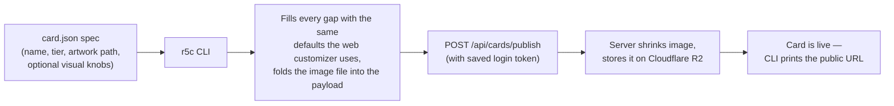
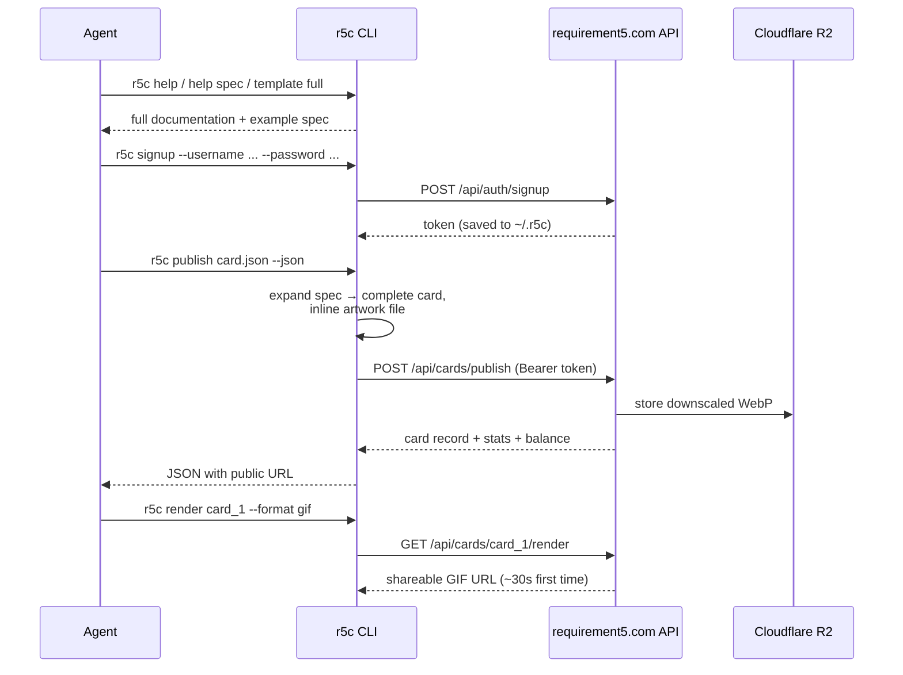

---
tags:
  - "r5c"
  - "cli"
  - "walkthrough"
---
# The `r5c` CLI — what was built and how agents use it

*2 July 2026 — session walkthrough*

## The one-paragraph version

Requirement5 now has a command-line client. You (or an agent) write **one small JSON
file** describing a card, run **one command**, and the card is live on
requirement5.com with its artwork stored on the CDN. It's installed on this machine
already — `r5c help` is the front door. Publishing was tested end-to-end against
production: a throwaway account published a real card, the image landed on
Cloudflare R2, the page loaded, and the test card was then deleted.

## The shape of a publish



The important idea: the spec file is **sparse**. A three-line spec produces a
complete, coherent card because the CLI generates all the background, pattern,
shine, border and holo settings a hand-made card would have. A maximal spec can
override every one of those knobs. Same pipeline either way.

## What happened, step by step

1. **Mapped the territory.** Read the Express API (auth, publish, render, economy),
   and had a search agent extract the *complete* card schema from the React
   customizer — every field, every allowed value, every slider range. That schema
   is what makes the CLI able to build "complex complete cards" rather than bare ones.

2. **Checked production.** Confirmed requirement5.com serves the app and proxies
   the API on the same domain, images go to Cloudflare R2, and new accounts get
   250 /t26.

3. **Built the CLI** (`cli/` in the repo, zero dependencies, plain Node):
   - **Auth** — `signup`, `login`, `logout`, `whoami`; token saved to
     `~/.r5c/config.json`, or supplied via the `R5C_TOKEN` environment variable.
   - **Cards** — `publish`, `template`, `get`, `list`, `collection`, `delete`,
     `render` (server-side GIF/MP4), `open`.
   - **Economy** — `balance`, `transactions`.
   - Nothing ever opens a browser unless you pass `--open`.

4. **Tested locally.** Ran the API on a spare port, published a card through the
   CLI, then loaded that card in the real web app with a **headless** browser and
   screenshotted it — artwork, both holo systems, borders and pattern all rendered.

5. **Tested production.** Throwaway account → publish → image verified on R2 →
   page verified live → card deleted. (Side note: that signup was literally
   **user number one** — the production database is fresh.)

6. **Shipped.** Committed to `main`, linked the `r5c` command globally, and wrote
   the docs (`cli/CLI.md`, plus everything under `r5c help`).

---

## How an agent works with this

This is the part designed for the r/midjourney plan: an agent that has never seen
this project can bootstrap itself from the CLI's own help output — no source
reading required.

### Step 1 — the agent gets its documentation

Three commands teach an agent everything, from broad to deep:

```bash
r5c help            # all commands, flags, env vars — the map
r5c help spec       # the full card-spec reference: every visual system,
                    # every field, every allowed value and range
r5c template full   # a maximal working example spec, as valid JSON —
                    # copy, edit, publish
```

`r5c help spec` is the key one: it lists the six tiers with their rarity bands,
the four holo effect systems with their parameter ranges, the eleven pattern
types, the fourteen blend modes — enough to *compose* a card, not just fill in
blanks. `r5c help publish`, `r5c help login` etc. give per-command detail, and
`cli/CLI.md` in the repo is the long-form version with agent recipes.

### Step 2 — the agent authenticates

```bash
# non-interactive, no prompts:
r5c signup --username art_scout_bot --password 'long-random-secret'
# → Signed up and logged in as art_scout_bot. Starting balance: 250 /t26.
```

The token is saved automatically and lasts 30 days. For CI or multi-account work
an agent can skip the stored file entirely and carry the token in the environment:

```bash
export R5C_TOKEN=$(curl -s https://requirement5.com/api/auth/login \
  -H 'Content-Type: application/json' \
  -d '{"username":"art_scout_bot","password":"..."}' | jq -r .data.token)
```

### Step 3 — the agent builds and publishes a card

```bash
cat > card.json <<'EOF'
{
  "name": "Neon Reliquary",
  "tier": "ultra",
  "tags": ["cosmic", "portrait"],
  "image": "./artwork.png",
  "card": {
    "backgroundColor": { "baseHue": 268 },
    "holoEffects": { "rareHolo": true, "rareHoloGalaxy": true },
    "rareHoloParams": { "intensity": "extreme" }
  }
}
EOF

r5c publish card.json --json
```

`./artwork.png` is just a file on disk — the CLI folds it into the request and the
server moves it to the CDN. With `--json` the agent gets machine-readable output;
the field it usually wants is `.url`:

```json
{
  "card":   { "id": "card_1", "tier": "ultra", "...": "..." },
  "stats":  { "saveCost": 72, "creatorDividend": 14.4, "...": "..." },
  "stake":  10,
  "balance": 40,
  "url":    "https://requirement5.com/card/card_1"
}
```

That URL is the deliverable — the thing you'd send to the artist on Reddit.
Add `--open` and it also opens in the browser (opt-in only, never by surprise).

### The whole agent session, as a picture



### How the agent recovers when things go wrong

Errors are designed to be self-explanatory so an agent can correct course
without human help. Exit code is always `1` on failure, message on stderr:

| Situation | What the agent sees |
|---|---|
| Typo'd tier, bad blend mode, unknown field | Field-level message listing the allowed values, *before* any network call |
| Artwork path doesn't exist | The path it tried, resolved absolutely |
| Token expired / missing | `401 … run 'r5c login'` |
| Balance too low to publish | `402 … check 'r5c balance'` |

### Raw API, if there's no CLI around

Everything the CLI does is plain JSON over HTTPS, so an agent without the binary
can still work: `POST /api/auth/signup` → token, then
`POST /api/cards/publish` with `Authorization: Bearer <token>` and a body of
`{ name, tier, rarityScore, tags, stateData }` — where `stateData` is the
expanded card object (`r5c template full` piped through the CLI shows the shape,
and images ride along as `data:image/...` URLs which the server swaps for CDN
links automatically).

---

## Where things live

| Thing | Where |
|---|---|
| CLI source | `cli/` (committed to `main`, `6badf77`) |
| Long-form docs + agent recipes | `cli/CLI.md` |
| In-terminal reference | `r5c help`, `r5c help spec` |
| Login token | `~/.r5c/config.json` (or `R5C_TOKEN` env) |
| Point at a dev server | `r5c config --api-url http://localhost:4000` |

## Natural next step

A watcher that scans r/midjourney for standout posts, drafts a card spec per
image, publishes through this CLI, and hands you the URLs to send to the
artists. The CLI was shaped so that layer is thin.
